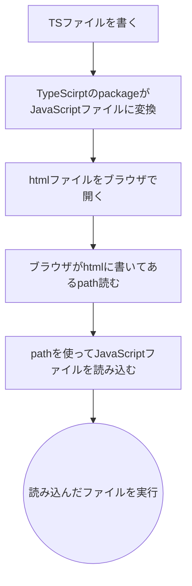

# 第5回後半研修

## 目的
 - TypeScriptを実際に書く
 - type, interface, ユニオン型への理解

## 環境
**OS:** Windows11
```cmd
node -v       
v22.16.0
npm -v
11.4.1
```

## TypeScriptの導入
> [!NOTE]
> **Node.js, npm のインストールは完了していることが前提です**

### 手順
1. コマンドを開きます。
2. Cドライブ直下に`repositorys`ディレクトリりその中に`class5_the_second_half`ディレクトリを作成してください。
	> [!NOTE]
	> リポジトリのディレクトリが既にある人は飛ばしてください。
	```cmd
	cd C:\
	mkdir repositorys\class5_the_second_half
	cd repositorys\class5_the_second_half
	```
	この手順内で`repositorys\class5_the_second_half`を単に**作業ディレクトリ**と呼ぶことにする。

3. VSCodeで作ったディレクトリを開いていく
	```cmd
	code .
	```
	 `code .`で開かない場合はGUI側から操作して行ってください。
4. VSCode側でターミナルを開く command: `ctrl + @`
5. 作業ディレクトリをnpmプロジェクトの初期化を行おう
	```cmd
	npm init
	```
	> [!NOTE]
	> 実行できない場合は、VSCodeでコマンドプロンプトを開きそこで実行してください。

	> [!IMPORTANT]
	> これをしないと `npm install` でpacageをインストールしたときにインストールされたパッケージの情報が `package.json` に記述されないので注意。
6. TypeScriptを動かすためのpackageをインストールする
	```cmd
	npm install typescript
	```
	`作業ディレクトリ\package.json` にtypescriptが追加されていることを確認する。
	```json
	{
		"dependencies": {
			"typescript": "^5.9.3"
		}
	}
	```
	`package-lock.json` ファイルが作成されていることと、`node_modues` ディレクトリが追加されていることを確認する。

## TypeScriptに触れる
今回はブラウザでJSに変換してから実行するTypeScriptに触れてもらう。
開発からページへの反映の流れは  

### HelloWorld
1. ファイルの作成  
	作業ディレクトリに `app.ts`, `index.html` を追加。
	
	#### index.html
	 ```html
	 <!DOCTYPE html>
		<html lang="en">

		<head>
			<meta charset="UTF-8">
			<meta name="viewport" content="width=device-width, initial-scale=1.0">
			<title>class5 the first half</title>
		</head>

		<body>

			<script src="./app.js"></script>
		</body>

		</html>
	```
	> [!NOTE]
	> `<script>` の `src属性` には **`app.js`** と書いてください。
	> 実際にブラウザが読み込むのはJavaScriptファイルであって、あくまでTypeScriptをJavaScriptに変換したものだからです。

	#### app.ts
	```ts
	console.log("hello, world!");
	```


2. TypeScriptをJSに変換
	#### この資料を書いたときの私のtypescriptパッケージバージョン
	```cmd
	npx tsc --version
	Version 5.9.3
	```
	#### 変換
	```cmd
	npx tsc app.ts
	```
3. HTMLファイルをブラウザで開く  
	好きなブラウザでhtmlファイルのpathを指定して開いてください。  
	開発者ツールを開き`console`タブに hello, world! と出ていれば成功です。

## 開発環境を整える
TypeScriptの実行はできましたがこのままでは、開発には不向きである。そのため、開発環境を整える必要がある。
### tsconfig.json の作成
作業ディレクトリに `tsconfig.json` ファイルを追加する。
このファイルは　`typescript`パッケージの設定を記述を行うためのファイルとなっている。
```cmd
npx tsc --init
```
作業ディレクトリ に `tsconfig.json` ファイルが作成されたことを確認する。

次に `tsconfig.json` を以下のように編集。
```json
{
  // Visit https://aka.ms/tsconfig to read more about this file
  "compilerOptions": {
    "module": "esnext",  //変更
    "target": "esnext",
    "types": [],
	//...
	}
}
```
これによって、ブラウザ用にTSの変換が行われるようになる。  
他にも`source_map`はブラウザ側でエラーが起こった時そのエラーが起きているTSの行を特定するかどうかの設定などデフォルトで複数の設定がなされた。

### テスト
正常に変換が行われることを確かめるために、`console.log("hello, world!");` を `console.log("hello, tsconfig.json!");` と書き換え変換を実行しブラウザ側で変更が適応されるか確認する。

## TypeScriptを学ぶ
TypeScriptはやっぱり型構文をJavaScriptに追加した言語なのである。  
Cに対するC++のような立ち位置で、JavaScriptのパッケージはTypeScriptで利用可能だったりする。

### どのように型構文(型アノテーション)が追加されたか。
#### 変数宣言(プリミティブ型)
**JavaScript**
```js
const userAge = 32;
const userName = "四羽 銅鑼介";
const userGender = "male";
```
**TypeScript**
```ts
const userAge: number = 32;
const userName: string = "四羽 銅鑼介";
const userGender: string = "male";
```
#### 変数宣言(Array, Map)
**JavaScript**
```js
const array = ["四羽 紫",  "四羽 青",  "四羽 緑", "四羽 銅鑼介"];
const map = new Map();
map.set("四羽 紫", "高校進学不可");
```
**TypeScript**
```ts
const array: Array<string> =  ["四羽 紫",  "四羽 青",  "四羽 緑", "四羽 銅鑼介"];
const map: Map<string, number> = new Map();
map.set("四羽 紫", 631);
```

#### 関数宣言
**JavaScript**
```js

function getIsAdult(age) {
	return 18 <= age;
}

const getIsAdult = age => 18 <= age;

function changeNameToTitle({
  name,
  isTeacher,
  ...rest,
}) {
  return {
    name: isTeacher ? `${name}先生` : name,
    isTeacher,
    ...rest,
  };
}

const changeNameToTitle = ({
  name,
  isTeacher,
  ...rest,
}) => {
  return {
    name: isTeacher ? `${name}先生` : name,
    isTeacher,
    ...rest,
  };
}
```
**TypeScript**
```ts


function getIsAdult(age: number): boolean {
	return 18 <= age;
}

const getIsAdult = (age: number): boolean => 18 <= age;

function changeNameToTitle({
  name,
  isTeacher,
  ...rest,
}: {
	name: String,
	age: number,
	gender: String,
	genderIdentity: String,
	lastExamScore: number,
}): {
	name: String,
	age: number,
	gender: String,
	genderIdentity: String,
	lastExamScore: number,
} {
  return {
    name: isTeacher ? `${name}先生` : name,
    isTeacher,
    ...rest,
  };
}

const changeNameToTitle = ({
  name,
  isTeacher,
  ...rest,
}: {
	name: String,
	age: number,
	gender: String,
	genderIdentity: String,
	lastExamScore: number,
}): {
	name: String,
	age: number,
	gender: String,
	genderIdentity: String,
	lastExamScore: number,
} => {
  return {
    name: isTeacher ? `${name}先生` : name,
    isTeacher,
    ...rest,
  };
}
```

型について `:` を用いて型を記述する構文を「**型アノテーション**」と呼ぶ。
これらTypeScriptで追加された型アノテーションはコードが冗長になる問題がある。そこでこの冗長さ解消するために登場するのがTypeScritpの型推論と型の定義だ。
ここからはどのようにしてTypeScriptの型構文を実用的な観点から使いやすくするかをテーマに説明をする。

### 型推論
型アノテーション使わなくとも、変数や関数がどのような型かということはある程度数学的に明確な推測ができる。
先ほどのプリミティブ型とArray,Mapの定義の例を用いる。
**TypeScript**
```ts
const userAge: number = 32;
const userName: string = "四羽 銅鑼介";
const userGender: string = "male";

//型推論をで型が決定されるたね省略
const userAge = 32;
const userName = "四羽 銅鑼介";
const userGender = "male";
```
これらは変数の型が何になるかは明らかだ。右辺がプリミティブ型のマジックナンバーで型が何であるかは**明確に決定されている**。この際、代入演算子の右から左へ型推論が行われ、左辺の型が決定される。そのため、型推論を前提と型アノテーションが省略することが可能となる。  
**TypeScript**
```ts
const array: Array<string> =  ["四羽 紫",  "四羽 青",  "四羽 緑", "四羽 銅鑼介"];
const map: Map<string, number> = new Map();
map.set("四羽 紫", 631);

//省略して書く
const array =  ["四羽 紫",  "四羽 青",  "四羽 緑", "四羽 銅鑼介"];
const map = new Map();
map.set("四羽 紫", 631);
```
この例も同様に**右辺の型が明確に決定されている**。そのため、代入演算子の右から左へ型推論が行われ、左辺の型が決定される。

逆に代入演算子の左から右への型推論について見ていこう。
**TypeScript**
```ts
const: Array<string> = [];
const map: Map<string, number> = new Map();
```
これらは**左辺の型が明確に決定されている**。そのため、代入演算子の左から右へ型推論が行われ、右辺の型が決定される。そのため、型アノテーションを省略することが可能となる。

次に関数宣言の例を用いる。
**TypeScript**
```ts
function getIsAdult(age: number): boolean {
	return 18 <= age;
}
const getIsAdult = (age: number): boolean => 18 <= age;

//省略して書く
function getIsAdult(age: number) {
	return 18 <= age;
}
function getIsAdult = (age: number) => 18 <= age;
```
これらは**引数と戻り値の型が明確に決定されている**。そのため、関数宣言の引数と戻り値の型推論が行われ、引数と戻り値の型が決定される。そのため、型アノテーションを省略することが可能となる。

### 型の定義
#### Interface
インターフェースはオブジェクトの型を定義するための構文である。
より明確に言うと、オブジェクトのプロパティの型と存在を保証する型のことである。
```ts
interface User {
	name: string;
	age: number;
	gender: string;
	genderIdentity: string;
	lastExamScore: number;
}
function changeNameToTitle({
	name,
	isTeacher,
	...rest,
}: User): User {
	return {
		name: isTeacher ? `${name}先生` : name,
		isTeacher,
		...rest,
	};
}
```
Interfaceを用いることでオブジェクトの型を再利用可能にしたり、コードの可読性を向上させることができる。このコードでは `User` インターフェースを定義し、`changeNameToTitle` 関数の引数と戻り値の型として使用している。
このコードはInterfaceの仕様を含めて見るとUserインターフェースによってnameやisTeacherなどのプロパティが存在することとその型が保証されている。それによってこの関数がTypeScriptとして実行可能な正しいコードであると言えるのだ。

前述したとおり、Interfaceはオブジェクトのプロパティの型と存在を保証する型であるから、異なったInterface同士であってもプロパティの型と存在が一致していれば互換性がある。
```ts
interface User {
	name: string;
	age: number;
	gender: string;
	genderIdentity: string;
	lastExamScore: number;
}

interface ExamResult {
	name: string;
	age: number;
}

const user: User = {
	name: "四羽 銅鑼介",
	age: 32,
	gender: "male",
	genderIdentity: "gay",
	lastExamScore: 448,
};

const getGender = (user: User): string => {
	return user.gender
};

const examResult: ExamResult = user; //互換性があるため代入可能
console.log(getGender(examResult)); //エラーは出ない maleと出力される
```
これはTypeScriptの構造的部分型付けによるものである。  
C++やJavaのような名前による型付けを「**名前的部分型付け**」と呼ぶのに対し、TypeScriptのように構造によって型付けを行うことを「**構造的部分型付け**」と呼ぶ。   
アヒルのように歩き、アヒルのように鳴くならばそれはアヒルである、という考え方である。

#### Type Alias
Type Aliasは型に別名をつけるための構文である。
```ts
type User = {
	name: string;
	age: number
	gender: string;
	genderIdentity: string;
	lastExamScore: number;
}
function changeNameToTitle({
	name,
	isTeacher,
	...rest,
}: User): User {
	return {
		name: isTeacher ? `${name}先生` : name,
		isTeacher,
		...rest,
	};
}
```
Type Aliasを用いることでオブジェクトの型を再利用可能にしたり、コードの可読性を向上させることができる。このコードでは `User` Type Aliasを定義し、`changeNameToTitle` 関数の引数と戻り値の型として使用している。  
InterfaceとType Aliasの違いはType Aliasはプリミティブ型やユニオン型などあらゆる型に別名をつけることができるのに対し、Interfaceはオブジェクトの型にのみ別名をつけることができるという点である。そして、Intetrfaceは拡張が可能であるのに対し、Type Aliasは拡張が不可能であるという点である。  
Reactを使ってWeb開発を行う際はInterfaceのほうが使用頻度が高いが、Type Aliasも使う場面はあるので両方覚えておくと良い。

さて、冗長な型アノテーションを省略するために型推論を用いることができると説明した。
型推論は変数宣言や関数宣言に対して有効である。型推論を用いることで、型の内容の変更が起こった時に修正する箇所を減らすとができたり、より直感的で可読性の高いコードを書くことができる。

#### interfaceの拡張
##### Declaration Merging
TypeScriptのInterfaceは拡張が可能である。  
```ts
interface User {
	name: string;
	age: number;
	gender: string;
	genderIdentity: string;
	lastExamScore: number;
}

interface User {
	isTeacher: boolean;
}

const user: User = {
	name: "四羽 銅鑼介",
	age: 32,
	gender: "male",
	genderIdentity: "gay",
	lastExamScore: 448,
	isTeacher: true, //追加されたプロパティ
};
console.log(user.isTeacher); //true
```
この方法は勝手にプロパティを追加宣言して拡張を行うことができる。
しかし、もともとあるプロパティを上書きすることはできないよう制限されている。
##### exntends
extends(継承)を用いることでInterfaceを拡張することもできる。 この方法だと、もともとあるプロパティを上書きすることも可能である。ただし、上書きするプロパティの型の範囲が狭まるように上書きしなければならない。
```ts
interface User {
	name: string;
	age: number;
	gender: string;
	genderIdentity: string;
	lastExamScore: number;
}
interface Teacher extends User {
	isTeacher: boolean;
	gender: "female" | "male"; //上書き。性別はfemaleかmaleのいずれか
	genderIdentity: 
		"female" | "male" | "lesbian" | "gay" | "bisexual" | "transgender" | "questioning"; 
		//上書き。性自認はこれらのいずれか。LGBTQに配慮した設計。しかし、LGBTQ+の全てを網羅しているわけではない。昔のWebサイトではいちいち性別の選択肢を増やしていたが、最近は「その他」などの選択肢を用意することが多い。
}
const teacher: Teacher = {
	name: "四羽 銅鑼介",
	age: 32,
	gender: "male",
	genderIdentity: "gay",
	lastExamScore: 448,
	isTeacher: true,
};
console.log(teacher.isTeacher); //true
```

#### ユニオン型
ユニオン型は複数の型のいずれかを許容する型である。  
```ts
type User = {
	name: string;
	age: number | null; //ageはnumber型かnull型のいずれか
	gender: string;
	genderIdentity: string;
	lastExamScore: number;
}
```
このコードでは `age` でユニオン型が使用されている。これを書いたコーダーは年齢を明かしたくないユーザーもいるだろうという配慮をしたのかもしれない。
ここで `|` は型同士の演算子であり、`number | null` で一つの「number型かnull型のいずれか」という型を表現している。
ユニオン型を使用することで、より柔軟な型定義が可能となる。主にデータベースからのデータ取得やAPIレスポンスの処理などで使用されることが多い。なぜならば、データが存在しないことを表すために `null` や `undefined` を使用することが一般的だからである。

#### 関数の型
TypeScriptでは関数の型を宣言できる。
```ts
type ChangeNameToTitle = (user: User) => User;

const changeNameToTitle: ChangeNameToTitle = (user) => {
	return {
		...user,
		//重複するプロパティは後ろのもので上書きされる
		name: user.isTeacher ? `${user.name}先生` : user.name, 
	};
};
```
このコードでは `ChangeNameToTitle` というType Aliasを定義している。  
`(user: User) => User` は「引数にUser型のuserを取り、User型の値を返す関数」という型を表現している。

この場合はアロー関数の定義において、代入演算子の**左辺で関数の型が明確に決定されている**。ゆえに、代入演算子の左から右へ型推論が行われ、右辺の関数の引数と戻り値の型が決定される。そのため、右辺の関数宣言において引数と戻り値の型アノテーションを省略することが可能となる。

## まとめ
- TypeScriptはJavaScriptに型構文を追加した言語である。  
- 型構文を用いることで、コードの可読性や保守性を向上させることができる。  
- 型アノテーションを用いることで、変数や関数の型を明示的に指定することができる。  
- 型推論を用いることで、冗長な型アノテーションを省略することができる。  
- InterfaceやType Aliasを用いることで、オブジェクトの型を再利用可能にしたり、コードの可読性を向上させることができる。  
- ユニオン型を用いることで、より柔軟な型定義が可能となる。

## 参考資料
- [TypeScript interfaceの拡張あれこれ #TypeScript - Qiita](https://qiita.com/pentamania/items/200e4c09285c01f8917f)
- [TypeScriptの型推論(type inference)を理解する #JavaScript - Qiita](https://qiita.com/tonio0720/items/6ab9ac56ae0406aad9dc)
- [\[初心者向け\] Typescriptプロジェクトを始める #JavaScript - Qiita](https://qiita.com/oharu121/items/3aadafdd5daa8dc53c64)
- [始めようTypeScript #AdventCalendar2022 - Qiita](https://qiita.com/shirak/items/bc571f36be74deeb8cb8)
- [TypeScript + Node.js プロジェクトのはじめかた2020 #JavaScript - Qiita](https://qiita.com/notakaos/items/3bbd2293e2ff286d9f49)
- [tsconfig.jsonの主要オプションを理解する #TypeScript - Qiita](https://qiita.com/ryokkkke/items/390647a7c26933940470)
- [`"module": "ESNext"`がちょっと理解できた #JavaScript - Qiita](https://qiita.com/a-ton/items/104b83260f5b356df74b)
- [TypeScriptの型定義パッケージ（@types/~）はどのバージョンをインストールすればいいのか #TypeScript - Qiita](https://qiita.com/munieru_jp/items/f2fec5580f53044a8496)
- [ソースマップとは #JavaScript - Qiita](https://qiita.com/Gaakuu/items/35dca603cb99d9e3d407)
- [npmとnpxの違い説明できますか？ #Node.js - Qiita](https://qiita.com/kohta9521/items/ee3ed4a2360add80ad79)
- [[Linux]mkdirコマンド #Linuxコマンド - Qiita](https://qiita.com/nakamurashun0621/items/3cbba7e53364b202eb08)
- [npm init しないとどうなる？ #npm - Qiita](https://qiita.com/sugurutakahashi12345/items/1049a33b86225f6345fe)
- [TypeScriptのインストールから実行まで #Node.js - Qiita](https://qiita.com/eiji-noguchi/items/8c1d3741ac9f2857b230)
- [【Node.js入門】npmとnpxの違い](https://zenn.dev/uniformnext/articles/c68ea2bb6cbe00)
- [TypeScript: Documentation - Declaration Merging](https://www.typescriptlang.org/docs/handbook/declaration-merging.html)
- [関数宣言 (function declaration) | TypeScript入門『サバイバルTypeScript』](https://typescriptbook.jp/reference/functions/function-declaration)
- [戻り値がない関数とvoid型 (void type) | TypeScript入門『サバイバルTypeScript』](https://typescriptbook.jp/reference/functions/void-type)
- [関数の型の宣言 (function type declaration) | TypeScript入門『サバイバルTypeScript』](https://typescriptbook.jp/reference/functions/function-type-declaration)
- [アロー関数 (arrow function) | TypeScript入門『サバイバルTypeScript』](https://typescriptbook.jp/reference/functions/arrow-functions)