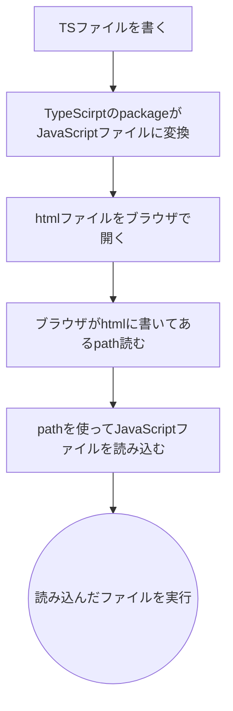

# 第5回後半研修

## 目的
 - TypeScriptを実際に書く
 - type, interface, ユニオン型への理解

## 環境
**OS:** Windows11
```
node -v       
v22.16.0
npm -v
11.4.1
```

## 手順
> [!NOTE]
> **Node.js, npm のインストールは完了していることが前提です**

### TypeScriptの導入
1. コマンドを開きます。
2. Cドライブ直下に`repositorys`ディレクトリりその中に`class5_the_second_half`ディレクトリを作成してください。
	> [!NOTE]
	> リポジトリのディレクトリが既にある人は飛ばしてください。
	``` 
	cd C:\
	mkdir repositorys\class5_the_second_half
	cd repositorys\class5_the_second_half
	```
	この手順内で`repositorys\class5_the_second_half`を単に**作業ディレクトリ**と呼ぶことにする。

3. VSCodeで作ったディレクトリを開いていく
	```
	code .
	```
	 `code .`で開かない場合はGUI側から操作して行ってください。
4. VSCode側でターミナルを開く command: `ctrl + @`
5. 作業ディレクトリをnpmプロジェクトの初期化を行おう
	```
	npm init
	```
	> [!IMPORTANT]
	> これをしないと `npm install` でpacageをインストールしたときにインストールされたパッケージの情報が `package.json` に記述されないので注意。
6. TypeScriptを動かすためのpackageをインストールする
	```
	npm install typescript
	```
	`作業ディレクトリ\package.json` にtypescriptが追加されていることを確認する。
	```
	{
		"dependencies": {
			"typescript": "^5.9.3"
		}
	}
	```
	`package-lock.json` ファイルが作成されていることと、`node_modues` ディレクトリが追加されていることを確認する。

### TypeScriptに触れる
今回はブラウザでJSに変換してから実行するTypeScriptに触れてもらう。
開発からページへの反映の流れは  

#### HelloWorld
1. ファイルの作成  
	作業ディレクトリに `app.ts`, `index.html` を追加。
	
	##### index.html
	 ```
	 <!DOCTYPE html>
		<html lang="en">

		<head>
			<meta charset="UTF-8">
			<meta name="viewport" content="width=device-width, initial-scale=1.0">
			<title>class5 the first half</title>
		</head>

		<body>

			<script src="./app.js"></script>
		</body>

		</html>
	```
	> [!NOTE]
	> `<script>` の `src属性` には **`app.js`** と書いてください。
	> 実際にブラウザが読み込むのはJavaScriptファイルであって、あくまでTypeScriptをJavaScriptに変換したものだからです。

	##### app.ts
	```
	console.log("hello, world!");
	```


2. TypeScriptをJSに変換
	##### この資料を書いたときの私のtypescriptパッケージバージョン
	```
	npx tsc --version
	Version 5.9.3
	```
	##### 変換
	```
	npx tsc app.ts
	```
3. HTMLファイルをブラウザで開く  
	好きなブラウザでhtmlファイルのpathを指定して開いてください。  
	開発者ツールを開き`console`タブに hello, world! と出ていれば成功です。

#### 開発環境を整える
TypeScriptの実行はできましたがこのままでは、開発には不向きである。そのため、開発環境を整える必要がある。
#### tsconfig.json の作成
作業ディレクトリに `tsconfig.json` ファイルを追加する。
このファイルは　`typescript`パッケージの設定を記述を行うためのファイルとなっている。
```
npx tsc --init
```
作業ディレクトリ に `tsconfig.json` ファイルが作成されたことを確認する。

次に `tsconfig.json` を以下のように編集。
```
{
  // Visit https://aka.ms/tsconfig to read more about this file
  "compilerOptions": {
    // File Layout
    // "rootDir": "./src",
	　"outDir": "./dist",    //追加する

    // Environment Settings
    //... (省略)
  }
}
```
これによって、```npx tsc``` コマンドを実行すると、`作業ディレクトリ\dist` にtsファイルのディレクトリ構成をそのままに保ちつつ、指定したディレクトリにjsファイルを作成するようになる。